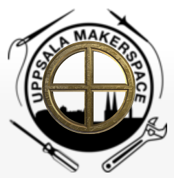
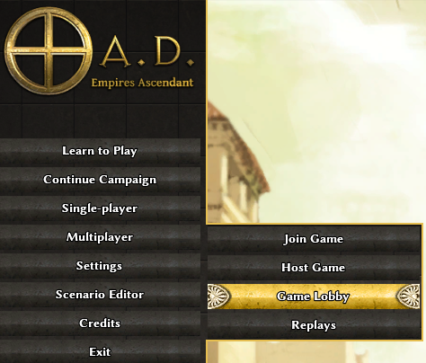
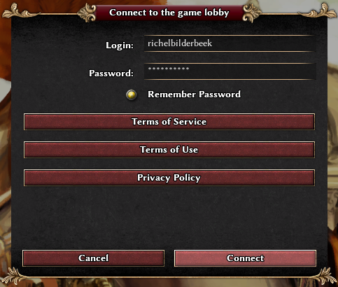
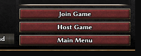
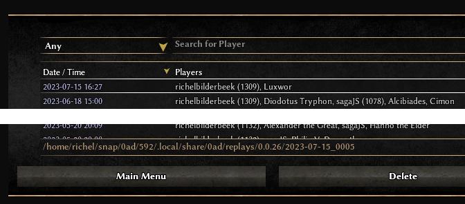

# ums_0ad_turnering_2023

0AD turnering hos Uppsala Makerspace 2023.

## Översikt

Först behöver deltagare skapa lag av 2 personer på Discord 
(ser Discord länk på 'Länkar' nedåt). 

Det finns fyra rundar:

 * 8:e final, mellan 16 lag
 * kvart final, mellan 8 lag
 * halva final, mellan 4 lag
 * final, mellan 2 lag

Varje run startar med ett meddelande på Discord server
vilka lag ska kämpa emot varann:

 * 8:e final: 2023-07-29 10:00
 * kvart final: 2023-08-05 10:00
 * halva final: 2023-08-12 10:00
 * final: 2023-08-19 10:00

Varje lag har 6 dagar för att kämpa emot varann.
Replay filen måste blir skickat till organisören före en deadline:

 * 8:e final: 2023-08-04 23:59
 * kvart final: 2023-08-11 23:59
 * halva final: 2023-08-18 23:59
 * final: 2023-08-25 23:59

Bara lag som vinner gör till nästa rund.
Vinnaren får sina pris på lördag 2023-08-26 under Lördagskurserna.

## Schemat, detaljerad

Dag          |Vad
-------------|-----------------------------------
FR 2023-07-28|Deadline deltagare före 23:59 
LÖ 2023-07-29|10:00 8:e final matchar bekant
SU 2023-07-30|.
MÅ 2023-07-31|.
TI 2023-08-01|.
ON 2023-08-02|.
TO 2023-08-03|.
FR 2023-08-04|Deadline 8:e final före 23:59 
LÖ 2023-08-05|10:00 kvart final matchar bekant
SU 2023-08-06|.
MÅ 2023-08-07|.
TI 2023-08-08|.
ON 2023-08-09|.
TO 2023-08-10|.
FR 2023-08-11|Deadline kvart final före 23:59 
LÖ 2023-08-12|10:00 halva final matchar bekant
SU 2023-08-13|.
MÅ 2023-08-14|.
TI 2023-08-15|.
ON 2023-08-16|.
TO 2023-08-17|.
FR 2023-08-18|Deadline halva final före 23:59 
LÖ 2023-08-19|10:00 final match bekant
SU 2023-08-20|.
MÅ 2023-08-21|.
TI 2023-08-22|.
ON 2023-08-23|.
TO 2023-08-24|.
FR 2023-08-25|Deadline final före 23:59 
LÖ 2023-08-26|(under Lördagskurser) Pris

## Vanliga frågor

### Vad är 0AD?

0AD är en 'Real-time Strategy' spel, 
lite likadant schack (det är mycket strategi!)
men man kan alltid göra mer drag.

 * [0AD hemsida](https://play0ad.com/): den officiella hemsida av 0AD 
 * [0AD på Wikipedia (Engelska)](https://en.wikipedia.org/wiki/0_A.D._(video_game)): den Wikipedia sida av 0AD (på Engelska)
 * [0AD YouTube kanal](https://www.youtube.com/user/play0ad): 0AD's officiella YouTube kanal
 * YouTube kanaler som visar strategier:
   * [Tom0AD YouTube kanal](https://www.youtube.com/@Tom0ad): 
     Tom0AD är en måttligt spelare, seriöst, detaljerad och har mycket videor.
   * [ValihrAnt YouTube kanal](https://www.youtube.com/@ValihrAnt): 
     ValihrAnt (den nuvarande världsmästare) är roligt. Tyvvär har han inte mycket videor
   * [0ADNewbieRush YouTube kanal](https://www.youtube.com/@0ADNewbieRush): 
     en newbie kanal
   * [Alistair Findlay YouTube kanal](https://www.youtube.com/watch?v=jQMETPZGRds&list=PLtv3Tue78X0UPnWc_3bPzC58Sm0b4G2ZX): 
     Alistair Findlay är också en bra spelere och har en konstigt type humor.
   * [richelbilderbeek's YouTube kanal](https://www.youtube.com/watch?v=K_M1geCdNhQ&list=PLu8_ZyzXyRDGTXZ1fQpcCPjeeX5MjIgxP): 
     `richelbilderbeek` är en måttligt spelare men gör videor med nuvarenda 0AD versioner

### Varför 0AD?

For deltagare:

 * Spelet är **gratis**
 * Spelet funkar på **värje styrningsystem** (dws Linux, Mac och Windows)
 * Spelet kann **intalleras utan admin/root rättigheter**.
   Bra om deltagaren har skoldartorer :-)
 * Spelet är en **utmaning för hjärnan**: 
   man behöver har ett smart strategi för att vinna
 * Spelet är bra för att **lära sig jobba tillsammans** i ett lag

For organisatören:

 * Pedagiskt: deltagare behöver har ett smart strategi för att vinna
 * Pedagogiskt: deltagare måste skapa ett lag och lära sig att jobba tillsammans
 * Praktiskt: spelet genererar s.k. replays, så organisatören behöver inte att
   kollar en spel live. Också: deltagare kann visar ärligt vem har vunnit

### Hur funkar turneringet?

Ser 'Översikt'

### Vad kan jag vinna?

Äran :-)

### Hur blir jag deltagare?

Det finns en Discord kanal var du kann göra det (ser 'Länkar' nedåt)
Du kan bli deltagare ensam eller i ett lag av två.

Du och din lagmedlem måste schicka er namn och lagnamnet till organisatören.

Om du är ensam: schicka din namn till organisatoren och du blir slumpmässigt
kopplad till någon annan.

### Vår lag vet vår motståndare. Hur spelar vi?

 * Tips: ser också [den här YouTube video](https://youtu.be/cQIAz1tjRyM)

Kontaktar motståndare på Discord och hitta en moment att ni fyra kann kämpa.

I 0AD, varje en av ni, går till 'Game Lobby':

> Klick på 'Multiplayer | Game Lobby'

Klicka 'Connect':

 * Tips: varje en behöver en account och måste har accepterad 
   'Terms of Service', 'Terms of Use' och 'Privacy Policy'

> Klick på 'Connect'

En av ni fyra behöver att 'Host game'.

 * Tips: använder en lösenord för er match så att bara ni kan delta

Den andra tre klick på 'Join game'

Ni väljer en 4 spelare karta.
Varje en delar med gästgivare (EN: 'host') vilken civilisation ni vill har.
Varja en klicka på 'I am ready' när hen är med.
Gästgivare (EN: 'host') klick på 'Start game' för att starta spel.

Lyckas till!

### Vår lag har spelat. Hur delar vi igenspelningen ?

Efter en match har varje spelare en igenspelning (EN: 'replay')
på sin dators festplatta. 

Du kan hitta var dina igenspelningar är med att klick på en
och kolla på nere av skärmet.

> Den här igenspelning är på `/home/richel/snap/0ad/592/.local/share/0ad/replays/0.0.26/2023-07-15_0005`

Schicka den hela folder till organisatören.

## Länkar

 * Discord länk: https://discord.gg/f3exdb9E
